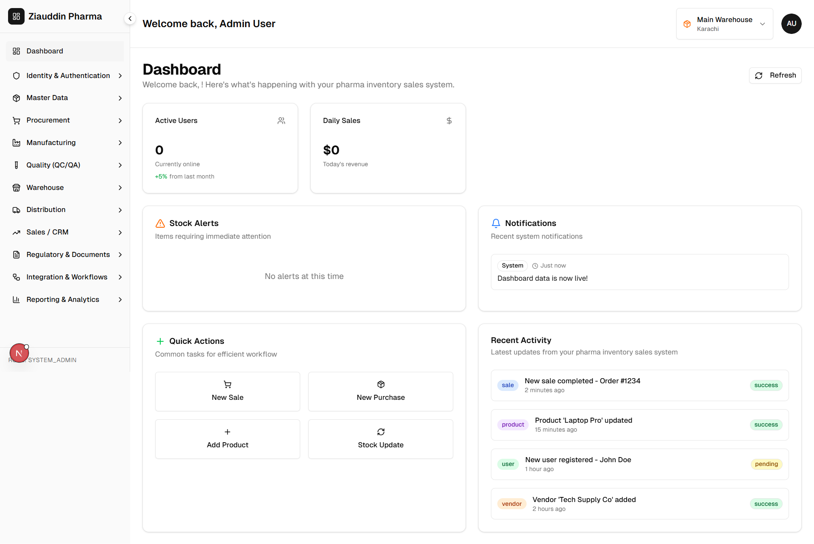

# Pharma – Sales & Inventory System

A full-stack **pharmaceutical sales and inventory management system** for **Pharma**, built with a microservices backend and a modern web dashboard. The system covers identity, master data, procurement, manufacturing, quality (QC/QA), warehouse, distribution, sales/CRM, and regulatory workflows.



*Dashboard: welcome view, KPIs, stock alerts, notifications, quick actions, and recent activity.*

---

## What We Are Building

We are building an **end-to-end pharma operations platform** that:

- **Unifies** inventory, sales, manufacturing, quality, and distribution in one place.
- **Supports** multi-site and role-based access (e.g. system admin, site manager, QC, warehouse).
- **Tracks** drugs, raw materials, batches, QC/QA, shipments, and sales from procurement to delivery.
- **Keeps** a single source of truth for master data (drugs, suppliers, sites, BOMs) and exposes it to all services via an API gateway.

The goal is to replace scattered spreadsheets and legacy tools with a single, auditable, and scalable system for Pharma’s daily operations.

---

## Problem We Are Solving

- **Fragmented data:** Inventory, orders, and quality data live in different systems or sheets, making reporting and traceability hard.
- **Manual workflows:** Purchase orders, goods receipt, QC sampling, and batch records are done manually, which is slow and error-prone.
- **Limited visibility:** No single dashboard for management to see stock alerts, daily sales, and recent activity across sites.
- **Compliance and traceability:** Pharmaceutical operations need clear audit trails (who did what, when) and linkage from raw material to batch to shipment.

This project addresses these by providing:

- A **central API gateway** that fronts multiple microservices.
- **Structured modules** for identity, master data, procurement, manufacturing, quality, warehouse, distribution, and sales/CRM.
- A **web dashboard** with KPIs, alerts, notifications, quick actions, and recent activity.
- **Role-based access** and site-scoped visibility where needed.

---

## Completed Work (So Far)

### Backend – Microservices & Gateway

| Area | What’s done |
|------|-------------|
| **API Gateway** | NestJS gateway on port 8000; JWT auth; routes under `/v1`; proxies to all microservices over TCP; global exception filter for connection errors (503 when a service is down); safe client port/host defaults per service. |
| **Identity Service** | Auth (login, refresh, logout), users, roles, permissions; JWT; site-scoped roles (`isSiteScoped` on Role); migration for `Role.isSiteScoped`; seeder for permissions and `system_admin` role with permission IDs. |
| **Master Data Service** | Sites, suppliers, drugs, raw materials, units, categories (and related CRUD). |
| **Procurement Service** | Purchase orders, goods receipts, supplier invoices; calls master-data for site/supplier/raw material enrichment; client defaults for master-data (host/port). |
| **Manufacturing Service** | Work orders, batches, batch steps, material consumption, **BOMs** (Bill of Materials), **EBR** (Electronic Batch Records); TypeORM entities and migrations for `boms` and `bom_items`; BOMs service and controller. |
| **Quality Service** | QC tests, QC samples, QC results, QA releases, QA deviations; TCP microservice on configurable port (e.g. 3003). |
| **Shared Package** | DTOs, enums, and message patterns (`@repo/shared`) used by gateway and services. |

Gateway manufacturing routes are split into **separate controllers** (like identity): work-orders, batches, material-consumption, boms, ebr, each with its own file under `api-gateway/src/manufacturing/`.

### Database & Migrations

- **Identity:** Migration adding `isSiteScoped` to `roles` table.
- **Manufacturing:** Migration creating `boms` and `bom_items` tables (with indexes and FK).
- **Seeder:** Identity seeder for permissions, roles (`system_admin`), and users; ensures `system_admin` role has permission IDs when data already exists.

### Frontend

- **Stack:** Next.js (App Router), React, TypeScript, Tailwind CSS, shadcn/ui-style components.
- **Auth:** Login page, auth context (`user`, `isAuthenticated`, `loading`), route guard (redirect to login when unauthenticated; token fallback to avoid redirect race after login).
- **Dashboard:** Main dashboard page with welcome message, KPIs (e.g. active users, daily sales), stock alerts, notifications, quick actions (New Sale, New Purchase, Add Product, Stock Update), and recent activity; data wired to gateway dashboard API where implemented.
- **Navigation:** Sidebar with sections: Dashboard, Identity & Authentication, Master Data, Procurement, Manufacturing, Quality (QC/QA), Warehouse, Distribution, Sales/CRM, Regulatory & Documents, Integration & Workflows, Reporting & Analytics.
- **Screens (examples):** Users, roles, permissions; drugs, raw materials, suppliers, sites; purchase orders, goods receipts; BOMs, work orders, batches, EBR; QC tests, samples, results, QA releases, deviations; warehouses, inventory, movements; sales orders, shipments; accounts, contracts; regulatory documents/approvals; reports.
- **Forms:** Raw materials add/edit form fixed (submit uses form state; FormSelect receives value, not event). BOM form uses FormSelect with `(value)` and FormTextarea for notes; Input component strips invalid `multiline` prop.
- **E2E:** Playwright setup and pharma flow spec (e.g. login, navigate).

### DevOps / Runbooks

- **Ports (typical):** Identity 3001, Master Data 3002, Quality 3003, Procurement 3004, Warehouse 3005, Manufacturing 3006, Sales Order 3007, Shipment 3008, Sales CRM 3009, API Gateway 8000, Frontend 3000.
- **Env:** Each app has `.env` (or example) for `DATABASE_*`, `*_SERVICE_HOST`, `*_SERVICE_PORT`, `JWT_SECRET`, etc. Gateway and feature modules use safe defaults (e.g. `localhost` and the ports above) when env vars are missing.

---

## Tech Stack

- **Backend:** Node.js, NestJS, TypeORM, PostgreSQL, TCP microservices, JWT.
- **Frontend:** Next.js 15, React 19, TypeScript, Tailwind CSS, react-hook-form, zod.
- **Testing:** Jest (unit), Playwright (e2e).
- **Monorepo:** pnpm workspaces; `backend-microservices` (gateway + apps + shared), `frontend`.

---

## Project Structure (High Level)

```
pharma-sales-inventory/
├── backend-microservices/
│   ├── api-gateway/          # NestJS gateway, JWT, proxies to services
│   ├── apps/
│   │   ├── identity-service/
│   │   ├── master-data-service/
│   │   ├── procurement-service/
│   │   ├── manufacturing-service/
│   │   ├── quality-service/
│   │   ├── warehouse-service/
│   │   ├── sales-order-service/
│   │   ├── shipment-service/
│   │   ├── sales-crm-service/
│   │   └── seeder/
│   └── packages/shared/      # DTOs, enums, message patterns
├── frontend/                 # Next.js app (dashboard, auth, forms)
├── dashboard.png             # Dashboard screenshot (this README)
└── README.md
```

---

## How to Run (Quick Start)

1. **Database:** PostgreSQL (local or Supabase). Create DB if needed; run migrations per service (e.g. identity, manufacturing).
2. **Backend:** From `backend-microservices`: `pnpm install`, then `pnpm dev` (or run gateway and each app separately). Set `.env` for each app (DB and service ports).
3. **Seed (optional):** From `backend-microservices`: `pnpm seed` to seed identity (permissions, roles, users).
4. **Frontend:** From `frontend`: `pnpm install`, `pnpm dev`. Open http://localhost:3000, log in (e.g. `admin@pharma.local` / `Admin@123` if seeded).
5. **Gateway:** Ensure API gateway is running (e.g. http://localhost:8000) so the frontend can call `/v1/*`.

---

## Project Status

**This project is still in progress.** Not all screens or APIs are fully implemented or production-hardened. Priorities ahead may include:

- Finishing remaining CRUD and workflows per module.
- Strengthening validation, error handling, and tests.
- Production deployment (e.g. Docker, env-based config).
- More dashboard widgets and role-specific KPIs.
- Document and audit trails for compliance.

The dashboard screenshot above reflects the current UI and structure; features and data will evolve as development continues.
